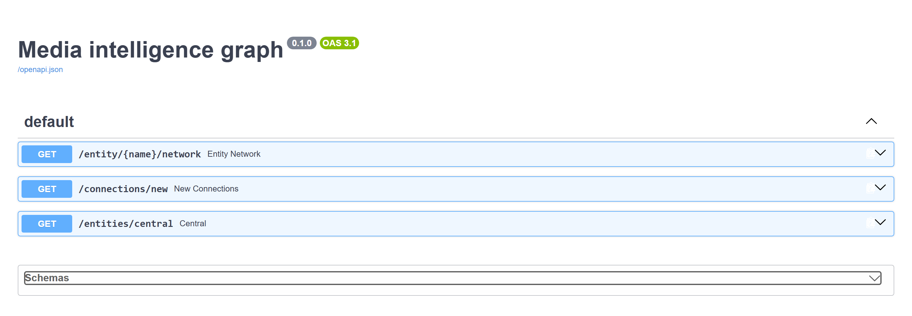
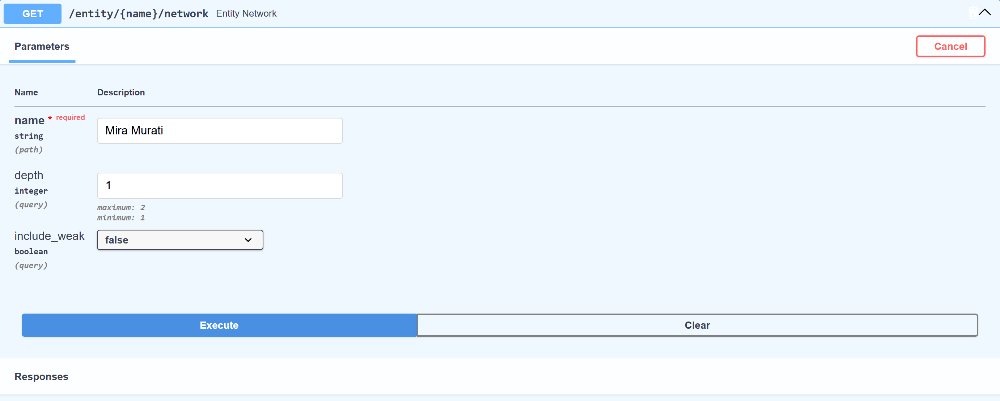
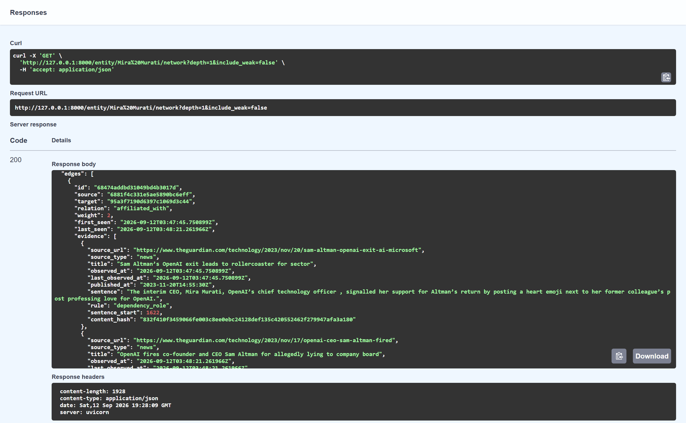
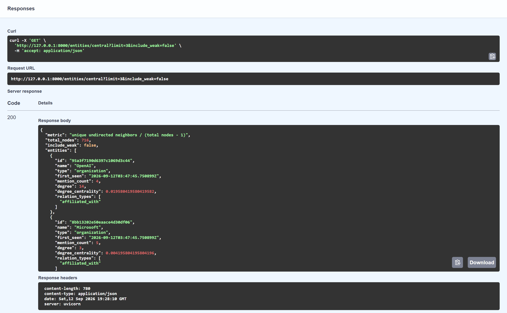
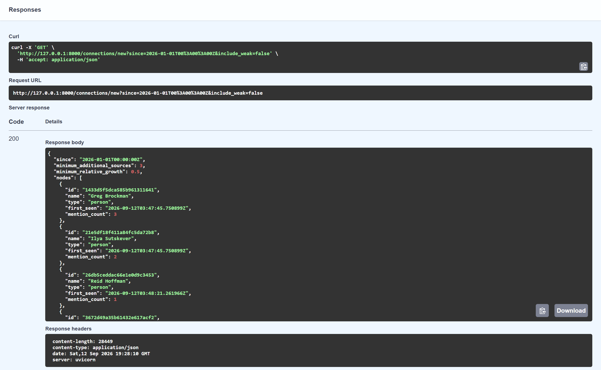
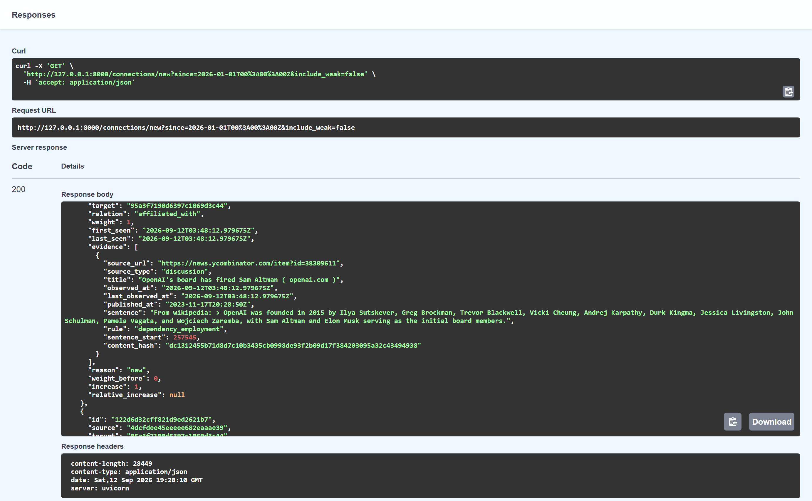
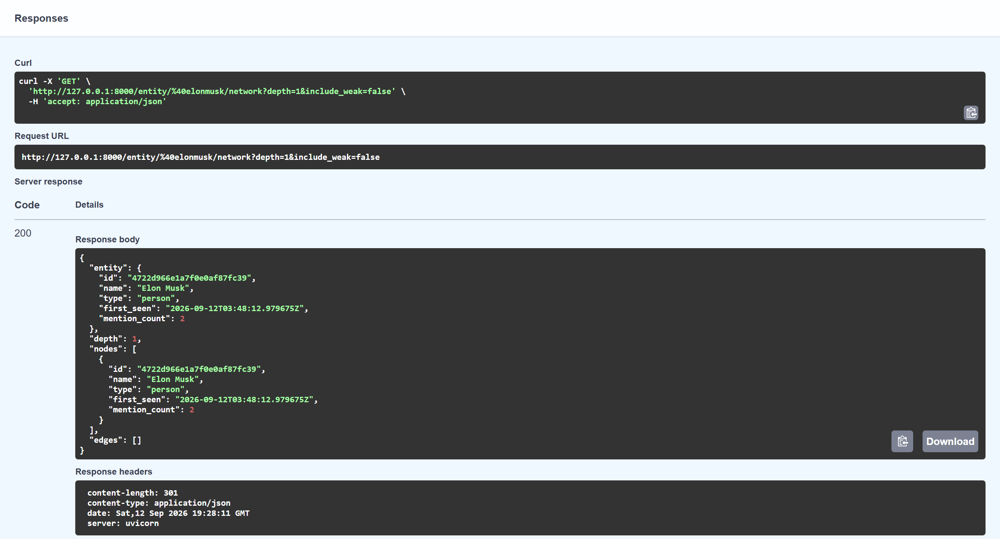
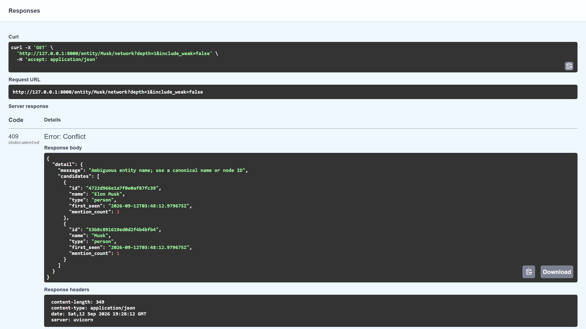

# Media intelligence engine

This project turns news articles, discussion threads and blog posts into a graph
of people, organisations, places and topics. An analyst can look up an entity,
follow its connections, see which relationships are gaining attention, and check
the original text behind each result.

The backend : a Python pipeline, a SQLite database and three FastAPI
endpoints. Crawl4AI collects the pages, and spaCy plus explicit rules extract the
entities and relationships. It runs locally and does not need paid APIs or API keys.

**Author:** Aryan Bharat Kumar ·
**GitHub:** [Aryan717317](https://github.com/Aryan717317)

[Run it locally](#run-it-locally) · [Try the API](#try-the-api) ·
[Screenshots](#working-project-screenshots) · [How it works](#how-it-works) ·
[Assessment reflections](#assessment-reflections)

## What the current run shows

The source configuration follows historical OpenAI coverage from The Guardian,
Hacker News and Microsoft's blog. News supplies reporting, discussions add public
reactions, and company posts give the organisation's own account. Their shared
subject gives the graph entities to connect across different page layouts.

| Result | Verified value |
| --- | ---: |
| Real pages processed | 6: two news, two discussion, two blog |
| Canonical entities | 716 |
| Connections | 557 |
| Typed affiliations | 22 |
| Weak co-mentions | 535 |
| Edge-to-source evidence records | 586 |
| Automated tests | 125 passed, 1 warning |

These graph counts come from reprocessing the saved real crawl after improving
relationship extraction and name resolution. Most edges are still weak
co-mentions; the typed count is not an accuracy score. Reply and quotation rules
are implemented and tested, but found no matching phrases in this six-page sample.

The [quality review](docs/quality-review.md) records the changes and remaining
mistakes. The [validation notes](docs/validation.md) cover the original live run,
a run with different seed URLs, and setup checks. The
[assessment checklist](docs/assessment.md) maps the work to the PDF's rubric.

### Hacker News and a subreddit

**Hacker News is already part of the working pipeline.** The default sources
include [the discussion about OpenAI's leadership change](https://news.ycombinator.com/item?id=38309611),
and the reviewed graph contains two Hacker News pages with traceable evidence.

The optional [discussion configuration](config/discussion-sources.yaml) includes
that thread and [an r/MachineLearning discussion of the same event](https://www.reddit.com/r/MachineLearning/comments/17xp85q/).
Reddit denied the live crawler check through `robots.txt`, so it is **configured
but not verified as an ingested source**. The six-page results and screenshots
do not include Reddit. The [source check notes](docs/discussion-sources.md)
record the denial and explain what remains to be validated.

## Run it locally

Use Python 3.11 or newer. The project was verified on Windows with Python 3.12.14.
Run the commands below from the repository root.

### 1. Clone the repository and create an environment

```shell
git clone https://github.com/Aryan717317/Chaos-Engineering-Media-Intelligence-engine.git
cd Chaos-Engineering-Media-Intelligence-engine
python -m venv .venv
```

Activate it in PowerShell:

```powershell
.\.venv\Scripts\Activate.ps1
```

On Linux or macOS, use `source .venv/bin/activate`. If activation is unavailable,
replace `python` in later commands with `.venv\Scripts\python.exe` on Windows
or `.venv/bin/python` on Linux/macOS.

### 2. Install the dependencies, model and browser

```shell
python -m pip install -r requirements.txt
python -m pip install https://github.com/explosion/spacy-models/releases/download/en_core_web_sm-3.8.0/en_core_web_sm-3.8.0-py3-none-any.whl
python -m playwright install chromium
python -m pip check
```

The model and browser need an initial download. On Linux, Playwright may also
need system packages; use `python -m playwright install --with-deps chromium`
if its browser dependencies are missing. Direct dependencies and the spaCy model
are pinned; pip resolves their transitive dependencies.

### 3. Build the graph, then start the API

```shell
python scripts/run_pipeline.py --strict --crawl-output data/crawl.json
python -m uvicorn app.api:app --host 127.0.0.1 --port 8000
```

Wait for the pipeline to finish before starting the API. It writes the graph to
`data/graph.db` and a run report to `data/run-summary.json`. The report lists page
failures, missing source types and database counts.

Then open **[http://127.0.0.1:8000/docs](http://127.0.0.1:8000/docs)**. Keep the API
process running while you use the page. This is a local address, so someone
reviewing the repository needs to run the project on their own computer.

The database and full scraped pages are generated locally and are excluded from
Git. Starting only the API creates an empty database; it does not run the crawler.
Live pages can change, so a new crawl may produce different counts from the saved
screenshots.

## Try the API

Start with a small query that makes the evidence easy to read:

1. Expand **GET /entity/{name}/network** and select **Try it out**.
2. Enter `Mira Murati`, set `depth` to `1`, and choose `false` for `include_weak`.
3. Click **Execute**. Under **Server response**, a `200` status means the request
   succeeded. Read **Response body** for the actual result.
4. Scroll inside that response to find `edges` and their `evidence`. The source
   URL, sentence and dates explain why each connection exists.

Swagger also shows an **Example Value** farther down the page. That describes
the response format; it is separate from the data returned by your request.

| Analyst question | Request |
| --- | --- |
| Who is connected to this person, and how? | `GET /entity/Mira%20Murati/network?depth=1&include_weak=false` |
| What is one step beyond their direct connections? | `GET /entity/OpenAI/network?depth=2&include_weak=false` |
| Which connections have appeared or grown since a date? | `GET /connections/new?since=2026-01-01T00:00:00Z&include_weak=false` |
| Which entities have the most connections? | `GET /entities/central?limit=5&include_weak=false` |

All three endpoints include weak `mentioned_with` edges by default. Set
`include_weak=false` to focus on typed relationships. A typed relationship still
needs its supporting text checked; the filter is not a correctness guarantee.

Network responses contain the root `entity`, the requested `depth`, and `nodes`
and `edges` with stable IDs. Edges refer to those IDs and include their type,
weight and evidence, so a frontend can use the response as graph data. Traversal
follows incoming and outgoing links and preserves each edge's direction. At
depth 2 it returns the traversed edges, without adding unrelated links solely
between nodes reached at the outer boundary.

Here is a shortened excerpt from the verified Mira Murati response. The full
response also includes timestamps and the evidence records.

```json
{
  "nodes": [
    {"id": "6881f4c331e5ae5890bc6eff", "name": "Mira Murati", "type": "person"},
    {"id": "95a3f7190d6397c1069d3c44", "name": "OpenAI", "type": "organization"}
  ],
  "edges": [
    {
      "id": "68474addbd31049bd4b3017d",
      "source": "6881f4c331e5ae5890bc6eff",
      "target": "95a3f7190d6397c1069d3c44",
      "relation": "affiliated_with",
      "weight": 2
    }
  ]
}
```

Use a canonical name or a node ID if a short name is ambiguous. Unknown names
return `404`; ambiguous names return `409` with candidate IDs. Invalid depth,
limit or timestamp values return `422`. Depth accepts 1 or 2, and the centrality
limit accepts 1–100. The `since` timestamp needs a timezone: use `Z`, or URL-encode
the `+` in a numeric offset. A future boundary returns no new connections.

### What counts as a new or growing connection?

In [queries.py](app/queries.py), `weight_before` counts supporting source URLs
first observed before `since`. `increase` counts those first observed at or after
the boundary.

- **New:** no supporting URLs before the boundary, and at least one afterwards.
- **Growing:** an existing connection gains at least **3 URLs**, and the gain is
  at least **50% of its earlier weight**. Both conditions must hold.

For example, an edge going from 4 sources to 7 qualifies: it gained 3 sources,
or 75%. An edge going from 20 to 23 does not: the gain is only 15%. These are
illustrations of the rule, not additional observations from the crawl.

I chose the absolute threshold to avoid flagging every single-page addition,
and the relative threshold to require a meaningful change for established edges.
It is a simple heuristic. It can miss a useful single-source story and gradual
growth on a well-covered subject.

The response includes the thresholds, `reason`, `weight_before`, `increase` and
`relative_increase`. New edges have a null relative increase because their
baseline is zero. **Time here means when the pipeline observed the evidence.**
Crawling a 2023 article in 2026 creates a newly observed connection, not a new
2026 event.

### What does centrality measure?

The score is normalised degree:

```text
degree_centrality = unique undirected neighbours / (total nodes - 1)
```

I chose it because it directly answers who has the broadest set of connections
in this graph. Multiple edge types or directions between the same pair count as
one neighbour. The denominator includes all stored nodes, including isolated
ones, even when weak edges are filtered. A graph with fewer than two nodes gets
a score of zero. Ties use mention count, then name and ID.

In the reviewed graph, OpenAI has 97 neighbours overall and 14 when weak edges
are excluded. The latter gives `14 / 715`, approximately `0.01958`. The response
also includes mention count and relation types. Degree does not identify people
who bridge otherwise separate groups, and it is strongly affected by the chosen
sources and extraction mistakes. It measures this corpus's connections, not
real-world influence.

## How it works

```text
Seed URLs and source settings
    -> Crawl4AI
    -> common content schema
    -> spaCy entities + configured topics
    -> name resolution + relationship rules
    -> SQLite nodes, edges and source evidence
    -> FastAPI queries
```

| Part | What it does |
| --- | --- |
| Crawl4AI | Fetches configured pages through a browser |
| Beautiful Soup | Reads article and discussion HTML into a common format |
| spaCy | Finds names and supplies the sentence parse used by relationship rules |
| PyYAML | Loads source settings, topics and known aliases |
| SQLite and Python's `sqlite3` | Store the graph and answer its queries |
| Pydantic, FastAPI and Uvicorn | Validate data and serve the API |
| pytest and HTTPX | Check extraction, storage and API behaviour |

The code follows those stages in `app/`. The runnable commands are in `scripts/`,
configuration is in `config/`, and checks are in `tests/`. More detailed decisions
and data reviews are in [docs/](docs/).

### Changing the sources

Edit [config/sources.yaml](config/sources.yaml) to change seed URLs, crawl depth,
page limits, allowed domains and HTML selectors. URLs live in configuration,
not in Python extraction logic. The supplied crawl limits are:

```yaml
max_depth: 1
max_pages: 6
max_links_per_page: 1
delay_seconds: 1
page_timeout_ms: 45000
```

Seeds start at depth 0. When adding a new site, update `allowed_domains` and its
`source_rules` as well as the seed list. Set the source type on the domain rule
so discovered pages receive the right type too. A site without a matching rule
defaults to `web`. The most specific domain rule wins, and rules also cover
subdomains.

Selectors such as `body_selector`, `comment_selector`, `title_selector`,
`author_selector` and `published_selector` handle differences between sites.
Invalid selectors fail early; missing matches use the available fallbacks and
report warnings. Depth and page budgets keep runs bounded, duplicate URLs are
removed, and failed pages still count towards the budget. Crawl4AI handles robots
checks. The whitelist restricts scheduled pages and accepted final URLs; it does
not filter every browser asset request.

Every normalised item contains `source_url`, `source_type`, `scraped_at`, `title`
and `body`, plus optional `author` and `published_at`. A missing title falls back
to the URL. Empty or challenge pages are reported as failures. Discussion comments
stay separate, and nested replies are removed from their parent's text to avoid
duplication. Author and publication metadata describe the thread where available;
the graph does not model individual comment authors or reply trees.

### Extracting and resolving entities

spaCy's `en_core_web_sm` model identifies people, organisations and locations.
Topics come from whole-phrase matches in [config/topics.yaml](config/topics.yaml),
so new themes outside that vocabulary can be missed. Text is processed in bounded
paragraph/comment batches, with offsets retained against the normalised body.

[entities.py](app/entities.py) cleans Unicode, case, spacing and punctuation,
then creates a stable ID from the canonical name and type. Known variants and
handles are configured in [config/aliases.yaml](config/aliases.yaml).

Short names need context. A first name or surname can use a unique full name in
the same paragraph or comment. Narrative articles can also use a unique surname
match across the document; discussion comments cannot borrow a name from another
reply. Correcting a surname's mistaken entity type also requires context indicating
a person, with guards for places and known organisations. Phrases mistaken for
full names cannot guide other merges. There is no fuzzy matching or general
pronoun resolution.

#### Entity example: Elon Musk

In the test sentence `Elon Musk spoke. Musk replied as @elonmusk.`, all three
forms resolve to one person. The full name supplies context for `Musk`, and the
handle is a configured alias. This is a regression fixture, not a scraped quote.

In the actual graph, `Elon Musk` and `@elonmusk` both return
`4722d966e1a7f0e0af87fc39`. Configured lookup aliases work even if a page uses only
the full name; they do not add mentions. A separate comment's unresolved `Musk`
mention remains in the graph, so that bare surname returns `409` with candidates.
Tests also cover a comment containing both Elon and Kimbal Musk. The resolver
merges when the context supports it and leaves competing identities explicit.

### Extracting relationships

[relationships.py](app/relationships.py) uses spaCy's sentence parse to connect
named subjects and objects, including coordinated names and passive wording.
It also recognises explicit roles such as a named company's CTO. Narrow phrase
rules supplement the parse.

| Relation | Meaning and direction | How it is detected |
| --- | --- | --- |
| `affiliated_with` | Person → organisation | Employment, hiring, joining, founding, leaving/dismissal, or an explicit role |
| `responded_to` | Responder → addressed entity | A reply/respond predicate with a named target |
| `quoted_by` | Quoted entity → quoting entity | An explicit active or passive quote predicate |
| `mentioned_with` | Symmetric weak co-mention | Nearby names in one sentence when no typed rule matches |

The weak fallback considers adjacent mentions with at most 12 intervening
whitespace-separated tokens. It does not add a weak duplicate for a pair already
given a typed relation in that sentence.

The rules reject negated, conditional and planned actions, along with explicit
prediction labels and future-role requests. They still struggle with sarcasm,
pronouns and complex clauses. `affiliated_with` includes historical departures
and firings; it does not mean someone currently works there. `quoted_by` needs
explicit quote wording and does not infer every attribution using “said”. These
are explainable extraction rules, not a way to establish whether a claim is true.

### Storage and source evidence

The explicit SQLite schema is in [app/schema.sql](app/schema.sql).

| Table | What it keeps |
| --- | --- |
| `nodes` | Canonical name and type, stable ID, first observation and mention count |
| `edges` | Endpoint IDs, relation type, weight, first and last observation |
| `sources` | Source URL and type, latest normalised body, title and available metadata |
| `edge_evidence` | The edge/source link, supporting sentence, offset, rule, dates and body hash |
| `node_mentions` | Which distinct sources mentioned each entity |
| `aliases` | Known and observed names used to look up a canonical entity |

**An edge's weight counts distinct source URLs that have supported that typed
connection.** Mention count also counts distinct URLs, rather than repeated
words. Crawling an unchanged page again updates its observation time without
giving it another vote. Each page is stored in a transaction with uniqueness
constraints and foreign keys.

Evidence keeps the earliest supporting citation and its hash; the source row
keeps the latest page content. Observation times are UTC and are separate from
publication dates. If a page removes a claim, the historical edge remains.
Different URLs can also carry copied stories, so source count does not guarantee
independent confirmation. These choices are explained in [docs/design.md](docs/design.md).

## Assessment reflections

### A. One real relationship: was it correct?

The [Guardian report on Sam Altman's dismissal](https://www.theguardian.com/technology/2023/nov/17/openai-ceo-sam-altman-fired)
contains this sentence in the saved, normalised text:

> Mira Murati, OpenAI’s CTO, will become interim CEO in his place, according to the statement.

The `dependency_role` rule in [relationships.py](app/relationships.py) binds
Mira Murati to OpenAI through the explicit CTO role and emits
`Mira Murati → affiliated_with → OpenAI`. That association matches the sentence.
The rule uses the stated CTO role; it does not need to treat the future interim-CEO
appointment as an established event.

The graph retains this sentence, its URL, publication time, observation time and
extraction rule. A second Guardian page supports the same edge, giving it weight
2. That is enough to explain the extracted relationship and inspect its evidence;
it does not establish her current role. The response and source text are visible
in the screenshots below.

### B. Where does entity normalisation break?

In the [Guardian Microsoft hiring report](https://www.theguardian.com/technology/2023/nov/20/sam-altman-openai-exit-ai-microsoft),
spaCy assigned some `Altman` surname mentions organisation or location types.
Because identity includes the entity type, the original resolver kept those
mentions apart from Sam Altman. That also caused the relationship stage to miss
person-to-organisation links.

The context checks in [entities.py](app/entities.py) now correct six reviewed
surname/type mistakes across the two news articles, including Altman and Brockman
in the hiring statement. However, short names are still a real limit. The
[Hacker News discussion](https://news.ycombinator.com/item?id=38309611) contains
both Sam and Annie Altman, and the actual `/entity/Altman/network` lookup still
returns `409`. A global `Altman → Sam Altman` alias would hide that ambiguity by
merging unrelated mentions.

During review, malformed model output such as `Will Sam` also attracted short-name
matches. Those spans are now excluded from guiding merges. The resolver can
protect against these cases, but it cannot reliably separate people with identical
full names or resolve every short name across comments. The
[quality review](docs/quality-review.md) records these examples and their fixes.

### C. How would I detect and suppress noisy edges at scale?

The current graph has 535 weak co-mentions. Sentence boundaries, the 12-token
proximity limit and distinct-URL counting reduce noise, and `include_weak=false`
lets an analyst filter those edges out. Typed rules need review too: an early
candidate treated a request to make Elon Musk CEO as an actual affiliation.
The request and prediction guards in [relationships.py](app/relationships.py)
now reject that claim.

My next step would be to sample the saved `edge_evidence` by extraction rule and
source type, label the errors, and measure which rules need tightening. I would
also group supporting pages by publisher and content hash to spot copied stories
that inflate weights. Those are proposed improvements; the current counter still
treats different URLs as different sources. Requiring several independent sources
would reduce some false positives, but it would also hide useful single-source
reports, so I would expose that as a filter rather than silently discard them.

### D. What would change if I replaced SQLite with Neo4j?

The current [queries.py](app/queries.py) needs shallow traversal and straightforward
counts, which SQLite handles without another service. A graph database would make
longer paths and questions such as “which people connect these two organisations?”
easier to express as the analysis grows.

The cost would be a database service to deploy, a driver, and changes to
[storage.py](app/storage.py) and the query layer. I would lose the convenience of
a single database file that a reviewer can inspect with SQL. Alias ambiguity,
source evidence and observation-time counting would still need careful modelling.
For this assignment's depth-1/2 queries, that extra setup is not justified.

### E. What would continuous updates require?

I would start by scheduling [scripts/run_pipeline.py](scripts/run_pipeline.py)
with non-overlapping runs. The storage layer already avoids giving the same URL
another vote, but continuous operation needs durable crawl checkpoints, bounded
retries and a way to resume failures. Content hashes could skip NLP work for
unchanged pages while their observation times advance.

The bigger gap is how updates change meaning. Today, an edge survives even when
its source removes the claim. Before calling this a current graph, I would add
evidence versions or retraction status. I would also monitor per-source failures
and extraction counts to catch broken selectors. SQLite WAL supports readers
during ingestion; writes should stay serial until measured contention gives a
reason to change that. A queue or distributed workers would be a later workload
decision, not the first step.

## Working project screenshots

These are actual Swagger requests against the reviewed graph, captured on
13 September 2026 in India (12 September UTC). Expand a section to see the
relevant result, and click an image for its full resolution. Some long response
boxes are scrolled to the fields being discussed.



<details>
<summary>Run a network query and follow its evidence</summary>

The controls request Mira Murati's direct connections with weak edges excluded.
The HTTP 200 response shows the typed affiliation, weight 2 and original source
text discussed in reflection A.





</details>

<details>
<summary>Find central entities</summary>

With `limit=3` and `include_weak=false`, OpenAI has 14 neighbours and Microsoft
has 3. Sam Altman is the third result, below the visible excerpt. The response
shows the formula and the total of 716 stored entities.



</details>

<details>
<summary>Inspect newly observed connections</summary>

The first image shows the timestamp boundary and growth thresholds. The second
scrolls to a discussion-sourced edge with `reason=new`, `weight_before=0` and
`increase=1`. The complete response has 22 typed edges. “New” refers to observation
time; the underlying discussion describes historical events.





</details>

<details>
<summary>Compare Elon Musk with @elonmusk</summary>

Both lookups return node `4722d966e1a7f0e0af87fc39`; the full responses were
checked for equality. `%40` in the handle's request URL encodes `@`. The empty
`edges` list is expected here: `include_weak=false` hides this person's weak
connections, and this sample has no retained typed affiliation for him.




</details>

<details>
<summary>See what happens when a surname is ambiguous</summary>

The bare surname `Musk` returns the intended HTTP 409 response with two candidate
IDs. Use a canonical name or ID to choose one. Swagger's “Undocumented” label
means the 409 response schema is not declared in the OpenAPI documentation.



</details>

<details>
<summary>Review source coverage and test output</summary>

This is a generated verification report from the SQLite database and actual
saved test output. It lists the six source URLs, graph counts and 125 passing
tests with one warning. It is labeled as a report, separate from the Swagger UI.


</details>

## Checks and useful commands

Run the deterministic tests with:

```shell
python -m pytest -q --basetemp=tmp/tests
```

The recorded run passed 125 tests with one dependency deprecation warning. Tests
cover source normalisation, alias ambiguity, relationship rules, repeat ingestion,
provenance, traversal and temporal/centrality boundaries. Live crawling was
checked separately. The changed-seed check replaced three URLs on the supported
sites; it does not establish that every unfamiliar site will parse correctly.

To collect pages without building the graph, or reprocess a saved crawl:

```shell
python scripts/crawl_sources.py --config config/sources.yaml --output data/crawl.json
python scripts/run_pipeline.py --from-crawl data/crawl.json --strict
```

Replay keeps the original observation times and is labeled `replay` in the
report. An exact replay of the reviewed input added no evidence and left all six
database tables unchanged.

Use a fresh database when comparing extraction rules, since existing databases
keep historical evidence. `--db PATH` sets the pipeline database; `MEDIA_DB_PATH`
sets the API database and is also the pipeline default when `--db` is omitted.
For example, in PowerShell:

```powershell
$env:MEDIA_DB_PATH = 'data/experiment.db'
python scripts/run_pipeline.py --strict
python -m uvicorn app.api:app --host 127.0.0.1 --port 8000
```

Both commands must point to the same database. If the API returns an unknown
entity after a crawl, check that path and `data/run-summary.json` first.

The pipeline exits with `0` when every configured source type contributes usable
content. It returns `1` for no usable content, a missing type, or any page failure
under `--strict`; setup, configuration or database failures return `2`. Without
strict mode, a partial run can succeed while still listing failed pages. A failed
live page may need another attempt or a selector update; inspect the report before
treating the run as complete.

## Known limits and next steps

This is a bounded English-language backend assessment. Short names, sarcasm,
pronouns, long clauses and topics outside the configured vocabulary still cause
misses or mistakes. Discussion metadata is at thread level, historical evidence
is not retracted, and large API responses have no pagination. The API is intended
for local evaluation and has no authentication or public hosting setup.

The next useful improvements are an annotated sample to measure extraction
quality, better handling of copied evidence and retractions, and crawl recovery
for repeated runs. The reflections above explain where each would fit in the
current code. The existing setup stays small enough to run, inspect and explain.
